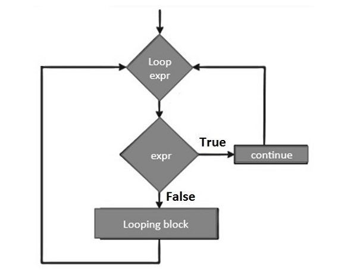

## While Loop
--------------

```
+-------------------+
| Initialize values |
+-------------------+
         |
         v
+-----------------------------+
| Evaluate while condition   |
| (Condition is True or False)|
+-----------------------------+
         |
   +-----+-----+
   |           |
   v           v
+--------+   +-------------------+
| Execute |   | Exit the loop    |
|  Block  |   | (Condition False)|
+--------+   +-------------------+
     |
     v
+-----------------+
| Update/Iterate  |
| (Optional)      |
+-----------------+
     |
     v
  Back to condition

```


```
# Example while loop

count=0
while count<5:
   count+=1
   print ("Iteration no. {}".format(count))

print ("End of while loop")


```

```

var = '0'
while var.isnumeric() == True:
   var = "test"
   if var.isnumeric() == True:
      print ("Your input", var)
print ("End of while loop")

```


```
var = 1
while var == 1 : # This constructs an infinite loop
   num = int(input("Enter a number :"))
   print ("You entered: ", num)
print ("Good bye!")


```


## While-Else Loop
--------------


```
count=0
while count<5:
   count+=1
   print ("Iteration no. {}".format(count))
else:
   print ("While loop over. Now in else block")
print ("End of while loop")


```

```

flag = 0
while (flag): print ("Given flag is really true!")
print ("Good bye!")

```


Syntax of break Statement
--------------------------


```
looping statement:
   condition check:
      break


```

break Statement with for loop
------------------------------

```

for letter in 'Python':    
   if letter == 'h':
      break
   print ("Current Letter :", letter)
print ("Good bye!")


```


break Statement with while loop
-----------------------------------
```
var = 10                   
while var > 0:              
   print ('Current variable value :', var)
   var = var -1
   if var == 5:
      break

print ("Good bye!")

```

break Statement with Nested Loops
--------------------------------------

```
no = 33
numbers = [11,33,55,39,55,75,37,21,23,41,13]
for num in numbers:
   if num == no:
      print ('number found in list')
      break
else:
   print ('number not found in list')

```


Continue Definition
--------------------

Python continue statement is used to skip the execution of the program block and returns the control to the beginning 
of the current loop to start the next iteration. When encountered, the loop starts next iteration 
without executing the remaining statements in the current iteration


Syntax of continue Statement
-----------------------------




```

looping statement:
   condition check:
      continue


```


Python continue Statement with for Loop
----------------------------------------

```
for letter in 'Python':
   if letter == 'h':
      continue
   print ('Current Letter :', letter)
print ("Good bye!")


```

Python continue Statement with while Loop
-----------------------------------------


```

num = 60
print ("Prime factors for: ", num)
d=2
while num > 1:
   if num%d==0:
      print (d)
      num=num/d
      continue
   d=d+1


```


Python Nested for Loop
-----------------------

The for loop with one or more inner for loops is called nested for loop. A for loop is used to loop over the items of any sequence, 
such as a list, tuple or a string and performs the same action on each item of the sequence.


Python Nested for Loop Syntax
------------------------------

```

for iterating_var in sequence:
   for iterating_var in sequence:
      statements(s)
   statements(s)

```


Python Nested for Loop Example
-------------------------------

```
for iterating_var in sequence:
   for iterating_var in sequence:
      statements(s)
   statements(s)

```


Python Nested For Loop Example
-------------------------------


```
months = ["jan", "feb", "mar"]
days = ["sun", "mon", "tue"]

for x in months:
  for y in days:
    print(x, y)

print("Good bye!")


```


Python Nested while Loop
--------------------------

The while loop having one or more inner while loops are nested while loop. A while loop is used to 
repeat a block of code for an unknown number of times until the specified boolean expression becomes TRUE.

```

while expression:
   while expression:
      statement(s)
   statement(s)

```


Python Nested while Loop Example
----------------------------------


```
i = 2
while(i < 25):
   j = 2
   while(j <= (i/j)):
      if not(i%j): break
      j = j + 1
   if (j > i/j) : print (i, " is prime")
   i = i + 1

print ("Good bye!")

```

Python pass Statement
------------------------
Python pass statement is used when a statement is required syntactically but you do not want any command or code to execute. 
It is a null which means nothing happens when it executes. This is also useful in places where piece of code will be added later, 
but a placeholder is required to ensure the program runs without errors.

Example of pass Statement
---------------------------

```
for letter in 'Python':
   if letter == 'h':
      pass
      print ('This is pass block')
   print ('Current Letter :', letter)
print ("Good bye!")

```
Dumpy Infinite Loop with pass Statement
----------------------------------------

while True: pass 


Syntax of Python for Loop
--------------------------

```
for iterating_var in sequence:
   statement(s)

```

Flowchart of Python for Loop
-----------------------------


Python for Loop with Strings
-----------------------------


```
zen = '''
Beautiful is better than ugly.
Explicit is better than implicit.
Simple is better than complex.
Complex is better than complicated.
'''
for char in zen:
   if char not in 'aeiou':
      print (char, end='')

```


Python for Loop with Tuples
----------------------------

```
numbers = (34,54,67,21,78,97,45,44,80,19)
total = 0
for num in numbers:
   total += num
print ("Total =", total)

```

Python for Loop with Lists
----------------------------

```
numbers = [34,54,67,21,78,97,45,44,80,19]
total = 0
for num in numbers:
   if num%2 == 0:
      print (num)

```

Python for Loop with Range Objects
-------------------------------------

```
for num in range(5):
   print (num, end=' ')
print()
for num in range(10, 20):
   print (num, end=' ')
print()
for num in range(1, 10, 2):
   print (num, end=' ')

```

Python for Loop with Dictionaries
-----------------------------------

```

numbers = {10:"Ten", 20:"Twenty", 30:"Thirty",40:"Forty"}
for x in numbers:
   print (x)

```


```
numbers = {10:"Ten", 20:"Twenty", 30:"Thirty",40:"Forty"}
for x in numbers:
   print (x,":",numbers[x])

```

```
fruits = ["apple", "banana", "cherry"]
for x in fruits:
  if x == "banana":
    continue
  print(x)

```

```

f=['apple','orange','grapes']

for x in f:
    if x != 'pple':
        break
    print(x)


```


```
adj = ["red", "big", "tasty"]
fruits = ["apple", "banana", "cherry"]

for x in adj:
  for y in fruits:
    print(x, y)

```


```

#!/bin/python3

import math
import os
import random
import re
import sys


if __name__ == '__main__':
    n = int(input().strip())
    if n%2 == 3:
        print("Weird")
    else: 
        if n in range(2, 6):
            print("Weird")
        elif n in range(6, 21):
            print("Weird")
        elif n > 20:
            print("Not Weird")


```


