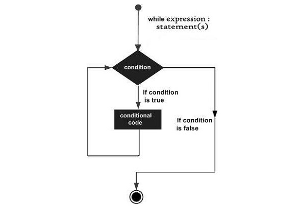
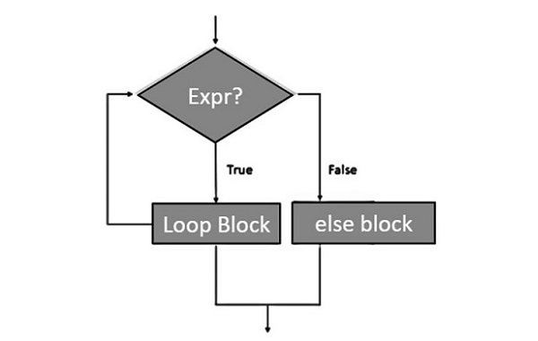

```
+-------------------+
| Initialize values |
+-------------------+
         |
         v
+-----------------------------+
| Evaluate while condition   |
| (Condition is True or False)|
+-----------------------------+
         |
   +-----+-----+
   |           |
   v           v
+--------+   +-------------------+
| Execute |   | Exit the loop    |
|  Block  |   | (Condition False)|
+--------+   +-------------------+
     |
     v
+-----------------+
| Update/Iterate  |
| (Optional)      |
+-----------------+
     |
     v
  Back to condition

```




```
# Example while loop
count = 0
while count < 5:
    print("Count is:", count)
    count += 1
```





